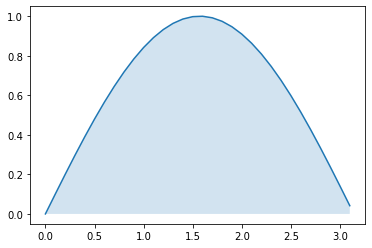

## Biblioteka algorytmów do rozwiązywania metod numerycznych

```python
import math

a, b = 0, math.pi
```

```python
import random
import math

def f1(x):
    return math.log(x) / x

def f(x): return math.sin(x)

def monte_carlo_method(f, a, b, n = 10_000):
    count = 0
    for i in range(n):
        x, y = random.uniform(a, b), random.uniform(0, 1)
        if y <= f(x): count += 1

    area = math.pi*1
    return count/n * area
```

```python
import matplotlib.pyplot as plt
import numpy as np

x = np.arange(a, b, 0.1)
y = [f(i) for i in x]
plt.plot(x, y)
plt.fill_between(x, y, 0, alpha=0.2)
plt.show()

```



```python
monte_carlo_method(f, a, b, 1_000_000)
```

    2.000138945205092

```html
<iframe src="https://www.wolframalpha.com/input/?i=integral+of+sinx+from+0+to+pi" width="800" height="400"></iframe>
<iframe src="https://www.wolframalpha.com/input/?i=integral+of+sinx+from+0+to+pi" width="800" height="400"></iframe>
```


```python
%precision 15
import numpy as np

def f1(x): return np.sin(x)
def f2(x): return x**2 * np.sin(x)**3
def f3(x): return x**2 * np.exp(x**2) * (x-1)

a, b = 0, np.pi
bottom, top = 0, 1
f = f1
```

```python
import os
import time

def generate_secure_randoms(x):
  start = time.time()
  random_numbers = []
  for _ in range(x):
    random_numbers.append(os.urandom(1))
  end = time.time()
  print(end - start)
```

```python
import numpy as np
import random

def monte_carlo_method(f, a, b, top, bottom, n = 100_000):
    count = 0
    for i in range(n):
        x, y = np.random.uniform(a, b), np.random.uniform(top, bottom)
        if y < f(x): count += 1
    p = (b-a)*np.abs(top-bottom)
    return count/n * (np.pi*1)

def trapezoidal(f, a, b, n):
    h = (b - a) / n
    sum_xi = sum(f(a + i*h) for i in range(n))
    return h/2 * (f(a) + 2*sum_xi + f(b))

def simpson(f, a, b, n):
        h = (b - a) / n
        result = f(a) + f(b)

        for i in range(1, n):
            xi = a + i*h

            if i % 2 != 0:
                result += 4 * f(xi)
            else:
                result += 2 * f(xi)

        return h/3 * result
```

```python
monte_carlo_method(f, a, b, top, bottom, 1_000_000)
```

    2.001288768116306

```python
simpson(f, a, b, 10_000_000)
```

    -98.19773011371367

```python
trapezoidal(f, a, b, 10_000_000)
```

    -381.9041632572264
```
